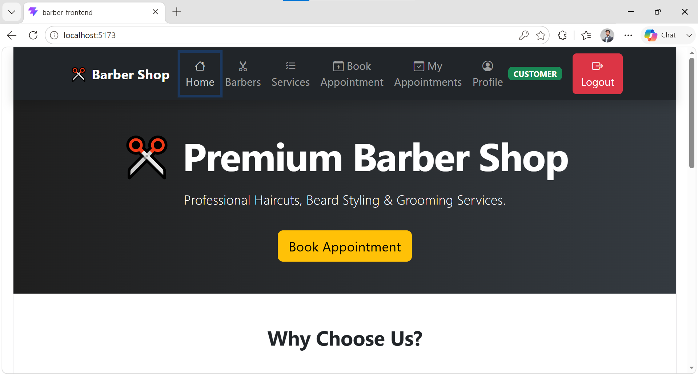
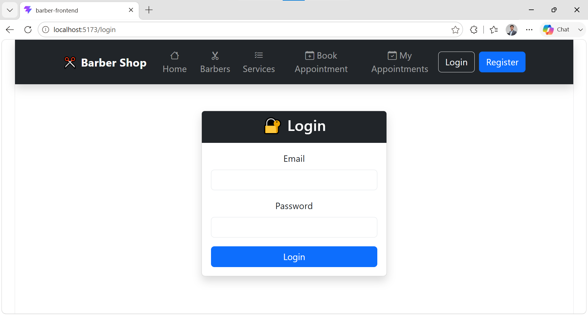
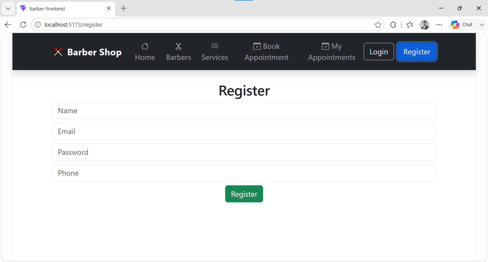
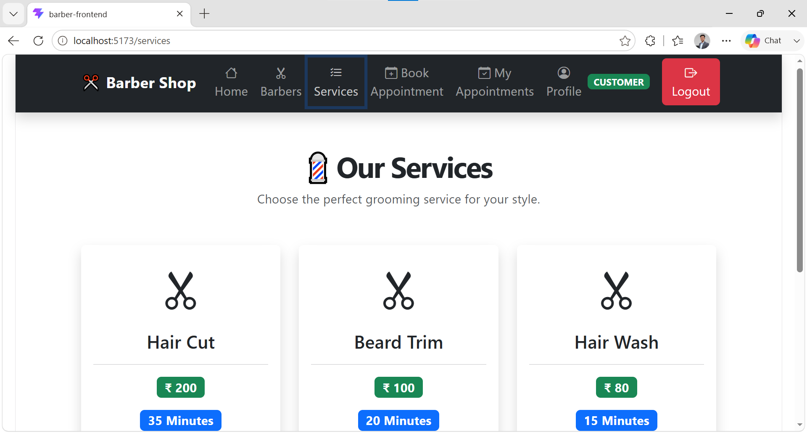
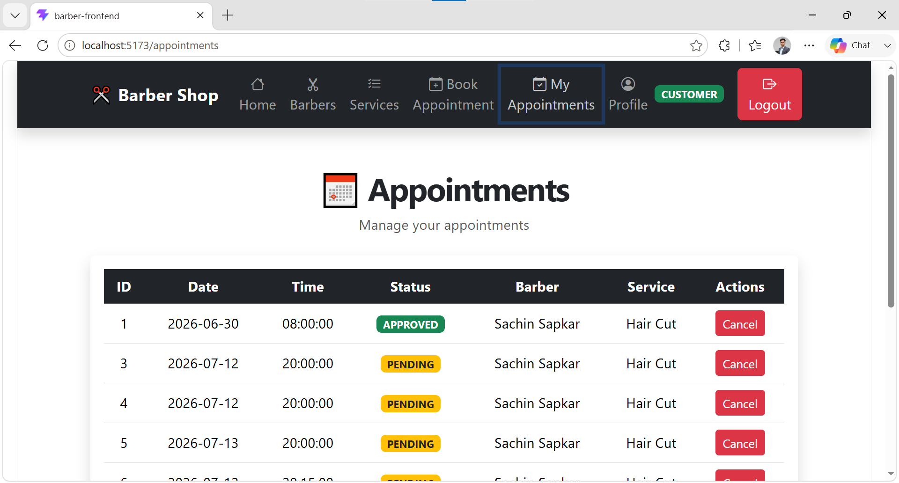
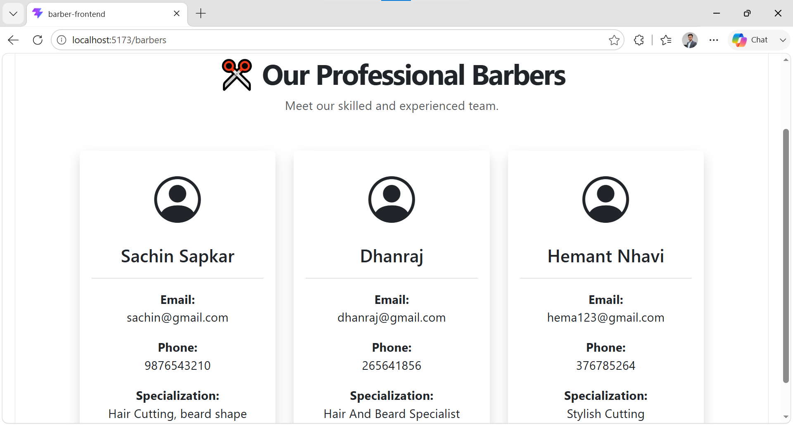

# 💈 Barber Shop Appointment System

A Full Stack Barber Shop Appointment System developed using **Spring Boot**, **React**, **MySQL**, and **JWT Authentication**.

This application allows customers to register, log in, book appointments with barbers, and view their appointments. It also provides an admin panel to manage barbers, services, and appointments.

---

# 🚀 Features

## Customer

- User Registration
- User Login
- JWT Authentication
- View Available Services
- Book Appointment
- View My Appointments

## Admin

- Admin Login
- Add, Update and Delete Barbers
- Add, Update and Delete Services
- View All Appointments

---

# 🛠 Tech Stack

### Backend
- Java
- Spring Boot
- Spring Security
- Spring Data JPA
- JWT
- Maven

### Frontend
- React
- Axios
- React Router
- CSS

### Database
- MySQL

---

# 📸 Project Screenshots

## Home Page



---

## Login Page



---

## Register Page



---

## Services



---

## Book Appointment


---

## Appointments



---

## Manage Barbers



---

# ⚙️ Installation

## Clone Repository

```bash
git clone https://github.com/rohitnile/Barber-Shop-Appointment-System.git
```

## Backend

```bash
cd barber-backend
```

Configure the following environment variables before running:

```text
DB_URL
DB_USERNAME
DB_PASSWORD
JWT_SECRET
```

Run the backend:

```bash
mvn spring-boot:run
```

## Frontend

```bash
cd barber-frontend
npm install
npm start
```

---

# 🔐 Authentication

- JWT Token Authentication
- Role-Based Authorization
- Protected APIs

---

# 📌 Future Enhancements

- Online Payment Integration
- Email Notifications
- Appointment Cancellation
- Barber Availability Management
- Dashboard Analytics

---

# 👨‍💻 Developer

**Rohit Nile**

GitHub: https://github.com/rohitnile

---
⭐ If you like this project, please consider giving it a star.
